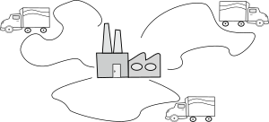

# Problema de Roteamento de Véıculos Capacitados (Capacitated Vehicle Routing Problem - CVRP).

# Como interpretar os arquivos:
As instâncias fornecidas seguem o formato: .
<br><br>
   *   O número de vértices pode ser encontrado no campo DIMENSION.<br>
   *   O número de veículos pode ser encontrado no campo VEHICLES.<br>
   *   A capacidade de cada veículo pode ser encontrada no campo CAPACITY.<br>
   *   A demanda de cada cliente pode ser encontrada no campo DEMAND_SECTION.<br>
   *  A matriz de custos pode ser encontrada no campo EDGE_WEIGHT_SECTION.<br>
<br><br>
Soluções ótimas<br>
   *   P-n16-k8 = 450<br>
   *   P-n19-k2 = 212<br>
   *   P-n20-k2 = 216<br>
   *   P-n23-k8 = 529<br>
   *   P-n55-k7 = 510<br>
   *   P-n51-k10 = 696<br>
   *   P-n50-k10 = 741<br>
   *   P-n45-k5 = 568<br>


# Objetivo

Neste projeto vai conter:

   *  Implementação de ao menos uma heurística de construção
   *  Implementação dos movimentos de vizinhança (Mínimo 3)
   *  Implementação do algoritmo de busca local chamado VND (Variable Neighborhood Descent)


# Introdução

<p align="center">
	<br>
	
      <br>
</p>

Nesse problema, uma frota de veículos é utilizada para visitar um conjunto de clientes realizando entregas de produtos. Cada veículo possui a mesma capacidade e cada cliente requer uma certa quantidade de produtos. O objetivo é criar um conjunto de rotas (uma para cada veículo) onde cada cliente é visitado exatamente uma vez, todas as demandas são atendidas sem exceder a capacidade dos veículos, e o custo de transporte é minimizado.

# O motor é desenvolvido é baseado em JavaFX.

Para Compilar o projeto de forma fácil, basta abrir utilizando Apache NetBeans 11 


# Programa

O modelo inicial da heurística conciste em procurar o vinho mais proximo e atender a demanda.

O número de caminhões usados para a frota é definido por NUM_VEHICLES e atendem a pelo menos um cliente (se a variável da lista tiver pelo menos um Vertice). 

Esse modelo define uma rota para cada caminhão como um Vector (Vector<Vertice> rota). Corresponde à sequência de clientes visitados. Para garantir que todos os clientes sejam atendidos, todas as variáveis do Vector são marcadas com um boolean isVisitado.
	
A quantidade entregue em cada visita é a demanda do Vertice desta visita. Essa expressão é apenas definida com getDemanda. A quantidade total entregue por cada caminhão é calculada com uma função para aplicar o somatorio sobre todos os clientes visitados por um caminhão. Observe que o número de termos nesta soma varia automaticamente com o tamanho do Vector. Essa quantidade é restrita a ser menor que a capacidade do caminhão.
		
Primeiro Verificamos se o Cliente já foi visitado, se já estiver sido visitado, a distancia ou demenda não imprta.
Caso não tenha sido visitado, verificasse a demanda, visto que, se o caminhão não pode atender, não importa a distancia do cliente.
Por for, verificasse a distancia, caso seja a mais proxima, é adicionado como proximo cliente.
	
```JAVA
for (int n = 1; n < NUM_VERTICE; n++) {

	//Se o elemento nao foi visitado
	if (vertices.get(n).isIsVisitado() == false) {
		if (vehicles.get(i).verificaCargaAtual(vertices.get(n).getDemanda())) {
			if (arestas.get(j).get(n).getPeso() != 0 &&
				arestas.get(j).get(n).getPeso() < menorDistancia) {
 				menorDistancia = arestas.get(j).get(n).getPeso();
                                //atualiza o cliente
				verticeAtual = n;
			}

		}

	}

}
```

Por fim, é feito mais umaverificação para garantir que não foi vistado e é adicionado na rota do cominhão, e é atualizado o vertice atual para a nova busca:

```JAVA
if (vertices.get(verticeAtual).isIsVisitado() == false) {
	vertices.get(verticeAtual).setIsVisitado(true);
	vehicles.get(i).newVertice(vertices.get(verticeAtual));
	vehicles.get(i).setCaminhoFeito(custoTotalAresta);

	custoTotalAresta += arestas.get(j).get(verticeAtual).getPeso();
	vehicles.get(i).setCaminhoFeito(custoTotalAresta);
	j = verticeAtual;
}
```

Para cada caminhão, a distância percorrida da visita é acessada com um arestas.get(j).get(n).getPeso() da matriz multidimensional arestas, com o primeiro índice. Aqui, novamente, usamos uma função para somar distâncias ao longo de cada rota.

```JAVA
for (int i = 0; i < NUM_VEHICLES; i++) {
	custoTotalAresta = 0;
	int clientes = 0;
	System.out.print("[DEPOSITO -> ");
	for (int j = 0; j < auxVehicles.get(i).getRota().size(); j++) {
		System.out.print(auxVehicles.get(i).getRota().get(j).getId() + " -> ");
	}
	System.out.println(" DEPOSITO]");

	int aux1, aux2;
	for (int j1 = 0, j2 = 1; j1 < vehicles.get(i).getRota().size() - 1; j1++, j2++) {
		aux1 = auxVehicles.get(i).getRota().get(j1).getId();
                aux2 = auxVehicles.get(i).getRota().get(j2).getId();
                custoTotalAresta += arestas.get(aux1).get(aux2).getPeso();
	}

	custoTotal += custoTotalAresta;
	System.out.println("custoTotalAresta: " + custoTotalAresta);
	System.out.println();
	clientes = vehicles.get(i).getRota().size() - 2;	
	clientesAtendidos += clientes;
}
System.out.println("Custo total: " + custoTotal);
```

# Movimento de vizinhança

Para melhorar os resultados obtidos, utilizamos a função swapVizinhanca(), nesta função pegamos o n - 2 Vertices da rota, ou seja, todos os clientes, menos o ponto de saída e chegada (Deposito), e realizamos trocas para procurar minimizar o custo da rota.
Primeiro criamos uma nova rota e trocamos de posição Cliente1 com Cliente2, e verificamos se foi melhorado o custo rota, e fazemos isso para todos os conjuntos **<var>N<sub>k</sub></var>** de **<var>k<sub>max</sub></var>** , diferentes estruturas de vizinhança.

Por fim, fazemos mais uma mudança, trocamos o primeiro cliente com o último cliente, ou seja, mais próximo ao deposito e verificamos se melhorou a rota.

```JAVA
for (int i = 0; i < NUM_VEHICLES; i++) {
	theAuxVehicles = vehicles.get(i);
	int aux1, aux2, custoTotalAresta1 = 0, custoTotalAresta2 = 0;
	for (int j1 = 0, j2 = 1; j1 < vehicles.get(i).getRota().size() - 1; j1++, j2++) {
		aux1 = vehicles.get(i).getRota().get(j1).getId();
		aux2 = vehicles.get(i).getRota().get(j2).getId();
		custoTotalAresta1 += arestas.get(aux1).get(aux2).getPeso();
	}

	auxVehicles.clear();
	for (int n = 1; n < (vehicles.get(i).getRota().size() - 2); n++) {
		//System.out.println(" V: "+((vehicles.get(i).getRota().size() - 2)/2));

                auxVehicles.add(new Vehicle(vehicles.get(i).getCapacidadeTotal(), 
				vehicles.get(i).getCargaAtual(),
                        	vehicles.get(i).getVerticeAtual(), 
				vehicles.get(i).isIsEntragando(), 
				vehicles.get(i).getCaminhoFeito()));

                auxVehicles.get(n - 1).setRota((Vector<Vertice>) vehicles.get(i).getRota().clone());

                Vertice auxVertice;

                auxVertice = auxVehicles.get(n - 1).getRota().get(n);

                auxVehicles.get(n - 1).getRota().set(n, auxVehicles.get(n - 1).getRota().get(n + 1));
                auxVehicles.get(n - 1).getRota().set(n + 1, auxVertice);

                custoTotalAresta2 = 0;
                for (int j1 = 0, j2 = 1; j1 < vehicles.get(i).getRota().size() - 1; j1++, j2++) {
                    aux1 = auxVehicles.get(n - 1).getRota().get(j1).getId();
                    aux2 = auxVehicles.get(n - 1).getRota().get(j2).getId();
                    custoTotalAresta2 += arestas.get(aux1).get(aux2).getPeso();

                }

	if (custoTotalAresta2 < custoTotalAresta1) {
		custoTotalAresta1 = custoTotalAresta2;
		theAuxVehicles = auxVehicles.get(n - 1);
	}

}
```
